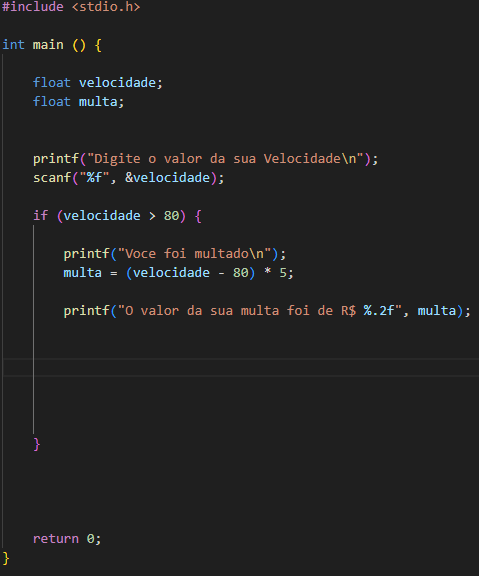
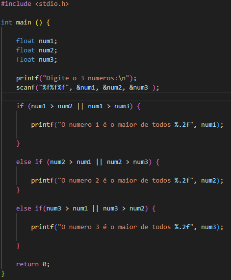

# Lista de exercício em C++

Vamos resolver a primeira lista da Linguagem C++.

## Lista 1 - Introdução à C e C++

1) Escreva um programa que solicite ao usuário a altura e o raio de um cilindro circular e
imprima o volume do cilindro. O volume de um cilindro circular é calculado por meio da
seguinte fórmula:

2) Escreva um programa que pergunte a velocidade do carro de um usuário. Caso ultrapasse
80 km/h, exiba uma mensagem dizendo que o usuário foi multado. Nesse caso, exiba o
valor da multa, cobrando R$ 5 por km acima de 80 km/h.

3) Escreva um programa que leia três números e que imprima o maior e o menor.

